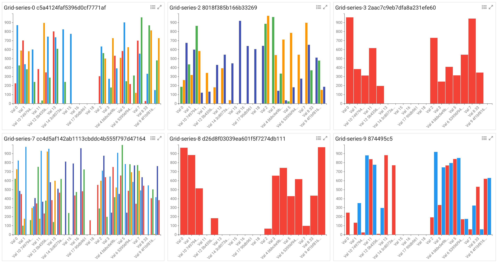
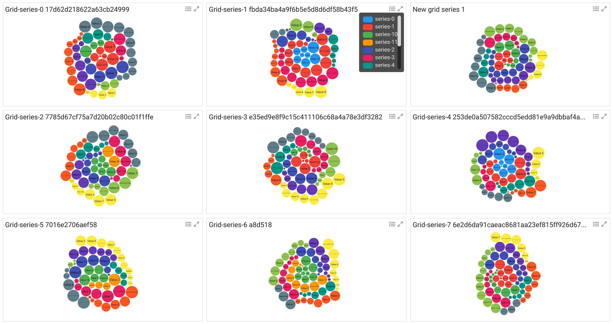
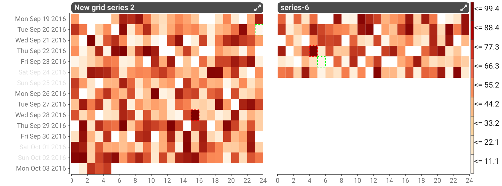
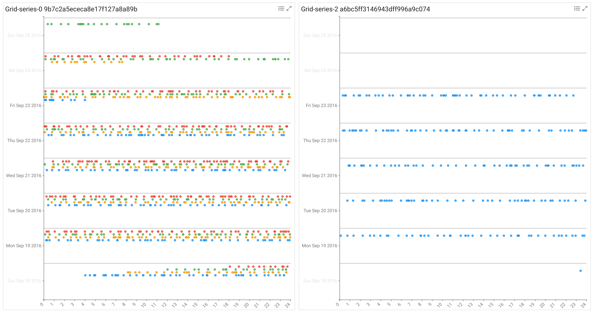
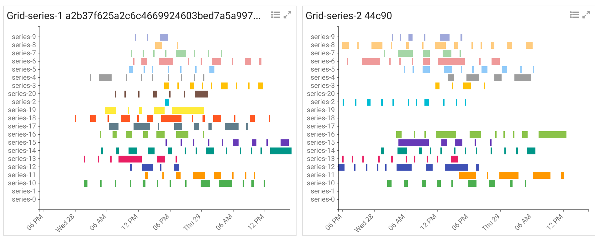

# Stroom Visualisations Development

Stroom Visualisations Development is a test harness for working with the custom data visualisations used within Stroom dashboards.  Stroom has the capability for custom JavaScript data visualisations to be added in at run time by end users. To allow for quick and easy development and testing of these visualisations this test harness was built. It currently generates randomised test data for each visualisation to enable development outside of Stroom.  It also servers as the master repository for the visualisation scripts created for Stroom and the metadata files that accompany them.

The custom visualisation framework in Stroom provides a means of adding any data visualisation that can be coded in JavaScript, without having to re-deploy a version of Stroom. Visualisations can be authored and managed by end users completely within the front-end of Stroom.

The aim of the Stroom Visualisations is to provide a set of visualisations with a consistent look and feel that conform to the Stroom visualisations API. Stroom stores a lot of data and often you need to visualise data at multiple levels of grouping. As a result of this the concept of the gridded visualisation was created to enable each visualisation to be displayed as grid of multiple visualisations, with one group of data per grid cell.

While these visualisations have been built for Stroom they are not tightly integrated with it and can easily be used in other applications as long as the data contract and API are met.

## Demo

To see the visualisations test harness in action visit the [demo page](https://gchq.github.io/stroom-visualisations-dev/), choose your visualisation/settings and click _Update_.

> _Note:_ Some of the visualisations are work in progress so may have bugs or may not be working at all in the test harness.

## Visualisation Features

Common features of these visualisations:

* Grid layout for displaying multiple groups of data on one screen/container
* Series/value colour pop-up legend, available by clicking the legend icon
* Series/value colour scales that can be synchronised across all grid cells
* Zoom in/out of individual grid cells by clicking the icon or grid cell title
* Highlight a series/value across all grid cells (whether the colour scales have been synchronised or not) by hovering over the legend key
* Hide/show series/values (with the visualisations re-scaling to suit) by clicking the legend key
* Axes that can be optionally synchronised across all grid cells
* Axes that can be optionally hidden
* Text labels that can be optionally hidden (e.g. doughnut)

Stroom visualisations usually conform to the following criteria:

* Fully data driven so respond when the source data is changed, i.e. the visualisations display the Stroom search results as soon as some data is found without having to wait for the full result set.
* Responsive to the size of the container they are displayed within
* Common flexible source data structure
* Common colour scheme and look/feel
* Built within the grid framework so we can optionally group data outside the level of the individual visualisation, and provide common controls such as legends
* Support hover tips and series/value highlighting
* Support user controlled hiding/showing of values or series

## Some examples

### Ordinal Bar Chart

### Bubble

### Hour Day Multi Heat Map

### Hour Day Point Map

### Series Session Map

## Test Data

Stroom Visualisations Development is designed to generate random test data applicable to each visualisation.  It also provides controls for configuring aspects of the visualisation, e.g. whether axes are displayed, whether series are synchronised, etc.  Controls are also provided for making changes to the data (e.g. adding a grid cell, series or altering values) to verify that the visualisation responds correctly to changes to the source data set.

## Stroom Content Packs

Stroom has an import feature allowing a set of Stroom entities (such as Visualisation and Script) to be imported as a content pack.

## Running Stroom Visualisations Development

`cd` into the war directory and run one of the following commands (depending on your python version) to start the python simple web server on port 8888

`python -m SimpleHTTPServer 8888` (python2)

`python -m http.server 8888` (python3)

In the browser (currently they have only been tested in Google Chrome) enter the URL

`http://localhost:8888/`

Select a visualisation from the drop-down list and click update.  The various tick boxes control some of the settings for the visualisations, though not all apply to all visualisations.  At some point we will improve the Stroom Visualisations Development front-end to be driven off the .settings.json files so the various configurations options displayed are specific to the vis chosen.

Alternatively if you use Tmuxinator/Tmux/Vim/Chrome then a Tmuxinator config file `stroom-visualisations-dev.yml` is provided to spin up the web server and open some of the source files in vim.

## Documentation

For more details on what visualisations are available and how to develop them see the [Documentation](./docs/SUMMARY.md).

